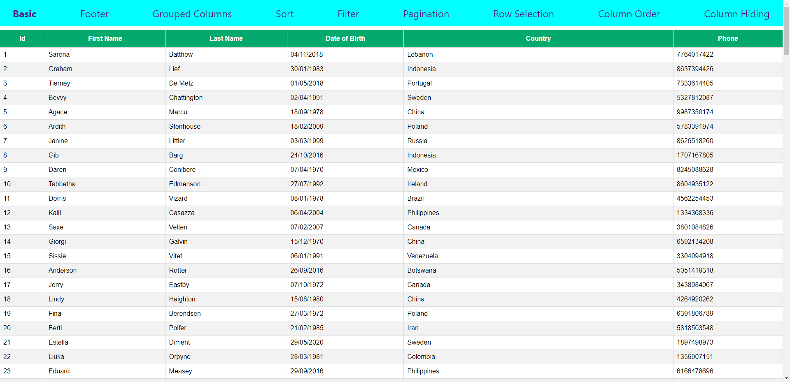

React Table Demo
================  

[Live Demo Website](https://utkarsh-react-table-demo.netlify.app/)  

React Table is a lightweight and extensible data tables for React, which helps us build and design powerful datagrid experiences while retaining 100% control over markup and styles.  

This repository contains demo code for:  
* Basic table
* Table with footer
* Grouped columns table
* Table data sort
* Table data filter
* Table data pagination
* Table row selection
* Table column order
* Hiding table columns

  